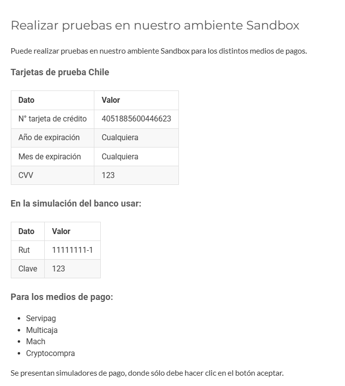

# Como simular el payment

1. Obtener las key de testing mediante flow url de sandbox, es una cuenta distinta a la de producción, ver las key aqui: https://sandbox.flow.cl/app/web/misDatos.php 
 - FLOW_API_KEY
 - FLOW_SECRET_KEY

Agregar esas key al archivo .env

2. crear una url de webhook temporal en  https://webhook.site
y añadir esa url en el archivo .env
 - WEBHOOK_URL

3. Avanzar por el flujo del frontend hasta llegar al boton de pago, una vez presionado esperar el procesamiento del pago, seleccionar webpay por ejemplo (mas detallaes en https://www.flow.cl/docs/api.html#section/Introduccion/Realizar-pruebas-en-nuestro-ambiente-Sandbox). y agregar los siguientes datos:

Tarjetas de prueba Chile
Dato	Valor
N° tarjeta de crédito	4051885600446623
Año de expiración	Cualquiera
Mes de expiración	Cualquiera
CVV	123

En la simulación del banco usar:
Dato	Valor
Rut	11111111-1
Clave	123

4. serás redirigido al pago aceptado